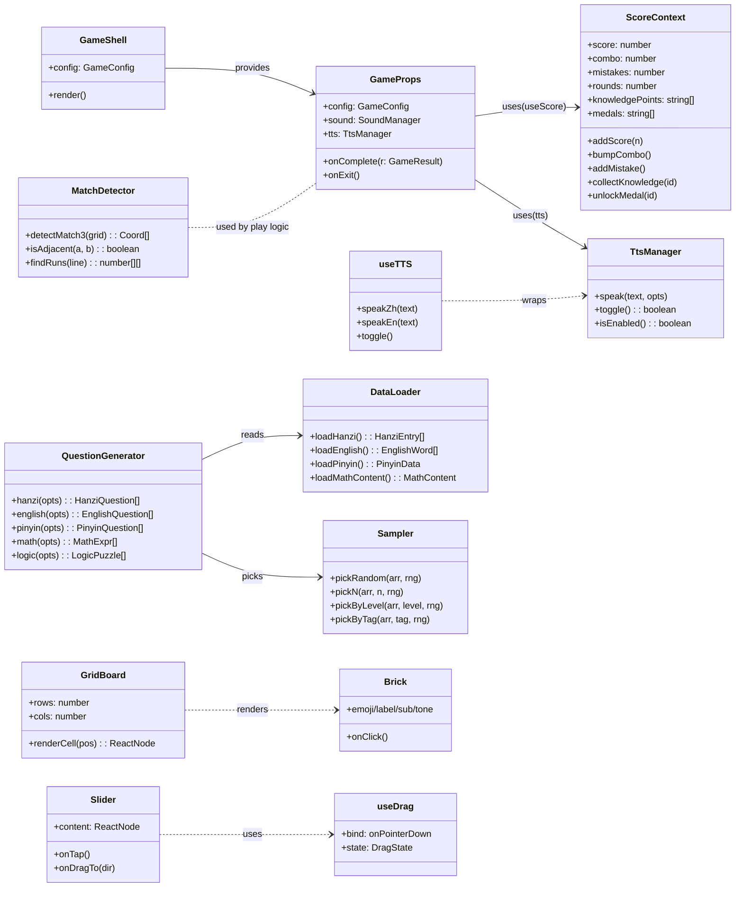
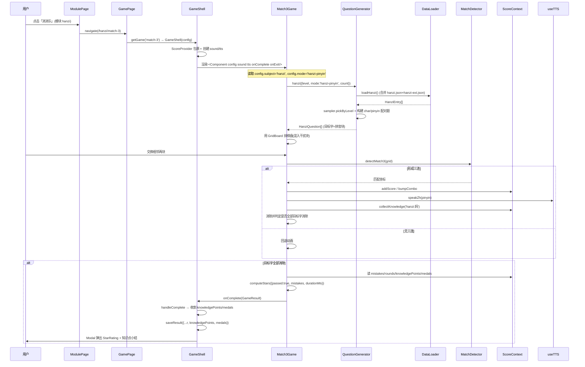
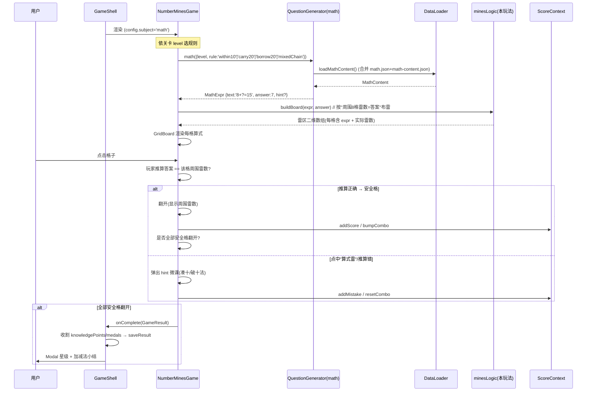
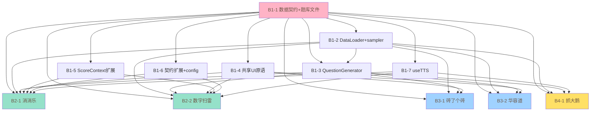

# 幼升小游戏合集 · 内容迭代 — 系统架构设计 + 任务分解

> 文档作者：架构师 高见远（software-architect）
> 输入来源：`prd-youxiao-content-iteration.md`（细化版 v2，不可推翻范围基线）
> 现状对齐：已完整探查仓库 `c:\Users\Administrator\WorkBuddy\2026-07-07-11-52-57\`，**基于现有代码约定设计，不凭空发明架构**
> 配套图：`docs/class-diagram.mermaid`、`docs/sequence-diagram.mermaid`

---

## 〇、现状勘探结论（设计前提）

探查后发现：**PRD 第七章所谓"建议抽为共享内核"在现状仓库中已大部分存在**。本迭代的"第 1 批共享内核"实为**对既有内核的扩展与补齐**，而非从零新建。这是本次设计最重要的前提。

| PRD 设想的"共享内核" | 现状仓库真实情况 | 本设计动作 |
|---|---|---|
| `GameShell` | ✅ `src/components/GameShell.tsx` 已存在（包裹 `ScoreProvider`、创建 `SoundManager`/`TtsManager`、渲染 HUD/Modal/StarRating、统一 `onComplete` 落盘） | **扩展**：在 `handleComplete` 中收割 `knowledgePoints/medals` |
| `useGameLoop` | ✅ `src/utils/gameLoop.ts` 已存在（`useGameTimer`/`useCountdown`/`computeStars`/`formatTime`） | **复用**，不新建 |
| `ScoreContext` | ✅ `src/state/ScoreContext.tsx` 已存在（`score/combo/mistakes/rounds` + 变更方法） | **扩展字段** `knowledgePoints/medals` + 方法 `collectKnowledge/unlockMedal` |
| `useTTS` | ⚠️ `src/sound/TtsManager.ts`（类）已存在并被 GameShell 以 `tts` 实例 prop 下传 | **新增薄 hook** `useTTS` 包装 `TtsManager` |
| 通用 UI `Card` | ✅ `src/components/Card.tsx` 已存在（tone/emoji/label/sub/selected/matched/wrong） | **复用**，新增 `GridBoard/Brick/Slider` 原语 |
| `DataLoader`+`sampler` | ⚠️ 仅有 `utils/rng.ts`(`createRng`)、`utils/shuffle.ts`(`shuffle/sample/pick`) | **新增** `DataLoader`（JSON 合并）+ `sampler`（按 level/tag 抽题） |
| `QuestionGenerator` | ❌ 不存在 | **新增** 四学科子生成器（纯函数、纯逻辑、可单测） |
| `Brick/Slider/MatchDetector/DragDrop` | ❌ 不存在 | **新增** 通用原语（Batch 1，不依赖具体玩法） |

**既有约定（必须沿用）**：
- 技术栈：Vite + React 18 + TypeScript + Tailwind 3 + `react-router-dom` v6（HashRouter）。`base:'./'`，纯前端、零后端。
- 游戏注册：`src/games/<module>/index.ts` 导出 `games: GameConfig[]` → `src/games/registry.ts` 聚合为 `allGames`/`gameMap`/`moduleGames`/`getGame(id)`。
- 游戏组件契约：`ComponentType<GameProps>`，`GameProps = { config, sound, tts, onComplete, onExit }`。组件通过 `onComplete(GameResult)` 结束，通过 `useScore()` 读写运行期分数。
- 数据访问：JSON 直接 `import`，`resolveJsonModule:true`；可复现随机 `createRng(seed)` + `shuffle(arr, rng)`。
- 设计令牌：`src/theme/tokens.ts`（palette: peach/mint/sky/lemon/cream/ink/inkSoft/white）+ Tailwind 同名色板；统一 `font-round`、`rounded-3xl`、`shadow-soft`、动画 `pop/wiggle/floaty/shake`。
- 测试：`src/__tests__/*.test.ts`（vitest），逻辑层纯函数单测，可固定 `Math.random` 断言。

**现状基线约束**：本地 commit `47e7639`（移除 9×9 解锁门槛 + 算术数独 cage 多色）属现状代码，本迭代**不改动数独**，仅新增玩法条目，须保证不回归。

---

## Part A：系统架构设计

### 1. 实现方案 + 框架选型

**技术栈确认**：Vite + React 18 + TypeScript + Tailwind CSS，纯前端（与现状、PRD 一致）。

**是否引入新依赖**：**否**。详细理由：
- 状态/路由/样式：全部沿用现状（`react`、`react-dom`、`react-router-dom`、`tailwindcss`），无新增。
- TTS 朗读：复用现状 `TtsManager`（已基于浏览器原生 `window.speechSynthesis`，离线零依赖、零模型文件）。新增 `useTTS` 仅为薄封装，无新包。
- 题库合并/抽题：`DataLoader`+`sampler` 基于现状 `utils/rng.ts`/`utils/shuffle.ts` 纯函数实现，无新包。
- 题目生成：四学科 `QuestionGenerator` 为纯 TS 逻辑，无新包。
- 动画：沿用 tailwind.config 既有 keyframes（`pop/wiggle/floaty/shake`），无新包。
- 测试：沿用 `vitest`（已在 devDependencies）。

**架构模式**：
- 以**既有的 `GameShell`（外壳/生命周期）为中心**的状态机：`选关(ModulePage) → 进行(GamePage+GameShell+GameComponent) → 星级结算(Modal)`。新玩法全部复用该外壳，不新建路由/外壳。
- **数据驱动 + 生成器模式**：题库（静态 JSON，全量扩充）+ `QuestionGenerator`（运行时按 `subject`/`level`/`mode` 生成题面）。静态知识词条与"无限题量"的算法题（数学）分离存储（见第五章）。
- **关注点分离**：每个玩法 = `XxxGame.tsx`（UI/交互，消费共享原语）+ `xxxLogic.ts`（纯逻辑，可单测）+ 注册条目。沿用现状 `makeTenLogic.ts`/`flipLogic.ts`/`mergeLogic.ts` 的分层惯例。
- **共享内核优先**：Batch 1 固化所有跨玩法契约（类型、加载、生成、UI 原语、评分扩展、TTS hook），后续玩法批次仅写玩法自身逻辑。

### 2. 文件列表（相对路径，标注 新建/修改，按批次）

#### 第 1 批（地基 · 共享内核 + 全量题库）— 不依赖任何玩法，可独立落地
| 文件 | 动作 | 说明 |
|---|---|---|
| `src/data/types.ts` | **新建** | 题库数据契约：`SubjectKey`、`HanziEntry`、`EnglishWord`、`Syllable`、`PinyinData`、`MathContent`、`AddSubtractRule` 等 |
| `src/data/hanzi-ext.json` | **新建** | 500+ 高频汉字全量（schema 见 PRD 5.2，含 initial/final/tone/antonym/measureWord/level/tags） |
| `src/data/english-ext.json` | **新建** | 100 日常高频英语词全量（PRD 5.3） |
| `src/data/pinyin-full.json` | **新建** | 完整音节体系（23 声母/24 韵母/16 整体认读 + syllables 例字，PRD 5.4） |
| `src/data/math-content.json` | **新建** | 算式/逻辑题面生成规则（PRD 5.5：`addSubtract` + `logic`） |
| `src/data/loader.ts` | **新建** | `DataLoader`：合并 `xxxx.json`（现状子集）+ `xxxx-ext.json`（全量） |
| `src/data/sampler.ts` | **新建** | `sampler`：`pickRandom`/`pickN`/`pickByLevel`/`pickByTag`（封装 rng+shuffle） |
| `src/data/generators/hanziGenerator.ts` | **新建** | 汉字题生成器（按 level/mode 产出 char-pinyin/antonym/measure 题） |
| `src/data/generators/englishGenerator.ts` | **新建** | 英语题生成器（word-emoji-meaning） |
| `src/data/generators/pinyinGenerator.ts` | **新建** | 拼音题生成器（取 syllables） |
| `src/data/generators/mathGenerator.ts` | **新建** | 数学题生成器：`genExpression`（加减/进位/退位/连加连减）、`genLogic`（sort/classify/pattern/reason） |
| `src/data/generators/index.ts` | **新建** | `QuestionGenerator` 门面：`generate(subject, opts)` 分发到四学科 |
| `src/components/GridBoard.tsx` | **新建** | 通用网格渲染原语（rows/cols/renderCell） |
| `src/components/Brick.tsx` | **新建** | 通用砖/卡原语（薄包 `Card`，含 slab 变体，供砖了个砖/配对） |
| `src/components/Slider.tsx` | **新建** | 通用滑块原语（供华容道，含 onTap/onDragTo） |
| `src/games/_shared/matchDetector.ts` | **新建** | 纯逻辑：三连判定 `detectMatch3`、相邻 `isAdjacent`、连续段 `findRuns` |
| `src/utils/useDrag.ts` | **新建** | 轻量 Pointer 拖拽 hook（`bind` + `state`），供滑块/砖块可选使用 |
| `src/sound/useTTS.ts` | **新建** | `useTTS(tts)` hook：封装 `TtsManager` → `{speakZh, speakEn, toggle, isEnabled, stop}` |
| `src/state/ScoreContext.tsx` | **修改** | 扩展 `knowledgePoints:string[]`、`medals:string[]` 与方法 `collectKnowledge`/`unlockMedal` |
| `src/state/ProgressStore.ts` | **修改** | `SaveInput`/`GameProgressRecord` 增加 `knowledgePoints?`/`medals?`；成就评估支持勋章 |
| `src/components/GameShell.tsx` | **修改** | `handleComplete` 收割 `knowledgePoints/medals` 并随 `saveResult` 落盘 |
| `src/games/types.ts` | **修改** | `GameConfig` 增加可选 `subject?: SubjectKey`、`mode?: string` |
| `src/data/config.json` | **修改** | 新增 5 玩法条目（match-3/number-mines/brick-match/klotski/goose-catch）含 `subject`/`mode`（与 registry 双写） |
| `src/__tests__/loader.test.ts` | **新建** | DataLoader 合并正确性 |
| `src/__tests__/sampler.test.ts` | **新建** | sampler 抽题正确性（固定 rng） |
| `src/__tests__/hanziGenerator.test.ts` | **新建** | 汉字生成器按 level/mode 产出 |
| `src/__tests__/mathGenerator.test.ts` | **新建** | 算式生成答案/范围、逻辑题结构 |
| `src/__tests__/matchDetector.test.ts` | **新建** | 三连/相邻判定 |
| `src/__tests__/scoreContext.test.ts` | **新建** | knowledge/medals 收集 |

#### 第 2 批（P0 玩法）
| 文件 | 动作 | 说明 |
|---|---|---|
| `src/games/hanzi/Match3/Match3Game.tsx` + `match3Logic.ts` | **新建** | 消消乐（汉字 subject=hanzi, mode=hanzi-pinyin） |
| `src/games/english/Match3/Match3Game.tsx` + `match3Logic.ts` | **新建** | 消消乐（英语 subject=english, mode=word-image） |
| `src/games/math/NumberMines/NumberMinesGame.tsx` + `minesLogic.ts` | **新建** | 数字扫雷（subject=math）：表达式生成 + 按答案布雷 + 凑十/破十微课 |
| `src/games/hanzi/index.ts`、`src/games/english/index.ts`、`src/games/math/index.ts` | **修改** | 注册上述玩法条目（含 subject/mode） |
| `src/__tests__/match3.test.ts`、`src/__tests__/numberMines.test.ts` | **新建** | 玩法逻辑单测 |

#### 第 3 批（P1 玩法）
| 文件 | 动作 | 说明 |
|---|---|---|
| `src/games/hanzi/BrickMatch/BrickMatchGame.tsx` + `brickLogic.ts` | **新建** | 砖了个砖（汉字 subject=hanzi, mode=char-pinyin） |
| `src/games/english/BrickMatch/BrickMatchGame.tsx` + `brickLogic.ts` | **新建** | 砖了个砖（英语 subject=english, mode=word-image） |
| `src/games/math/Klotski/KlotskiGame.tsx` + `klotskiLogic.ts` | **新建** | 华容道（subject=math）：排序/分类/规律/推理，消费 `genLogic` |
| 对应 `index.ts` | **修改** | 注册条目 |
| `src/__tests__/brickMatch.test.ts`、`src/__tests__/klotski.test.ts` | **新建** | 玩法逻辑单测 |

#### 第 4 批（P2 玩法）
| 文件 | 动作 | 说明 |
|---|---|---|
| `src/games/hanzi/GooseCatch/GooseCatchGame.tsx` + `gooseLogic.ts` | **新建** | 抓大鹅（汉字 subject=hanzi, mode=char-listen，TTS 播 pinyin） |
| `src/games/english/GooseCatch/GooseCatchGame.tsx` + `gooseLogic.ts` | **新建** | 抓大鹅（英语 subject=english, mode=word-look，显 emoji） |
| 对应 `index.ts` | **修改** | 注册条目 |
| `src/__tests__/gooseCatch.test.ts` | **新建** | 玩法逻辑单测 |

### 3. 数据结构与接口（类图 / TS 接口契约）

> 下列接口为 Batch 1 必须固化、工程师可直接动手的契约。

#### 3.1 数据类型契约（`src/data/types.ts`）
```ts
export type SubjectKey = 'hanzi' | 'pinyin' | 'english' | 'math';

export interface HanziEntry {
  char: string; pinyin: string; emoji: string; meaning: string;
  initial?: string; final?: string; tone?: number;
  radical?: string; strokes?: number;
  antonym?: string; measureWord?: string;
  level?: 1 | 2 | 3; tags?: string[];
}
export interface EnglishWord {
  word: string; emoji: string; meaning: string;
  category?: string; sentence?: string; level?: 1 | 2 | 3;
}
export interface Syllable {
  initial?: string; final?: string; pinyin: string; tone: number;
  char?: string; emoji?: string; meaning?: string; level?: 1 | 2 | 3;
}
export interface PinyinData {
  initials: string[]; finals: string[]; wholeSyllables: string[];
  syllables: Syllable[];
}
export interface AddSubtractRule {
  ops: ('+' | '-')[]; max: number;
  strategies?: string[]; hint?: string; terms?: number;
}
export interface MathContent {
  addSubtract: Record<string, AddSubtractRule>;
  logic: {
    sort: { types: string[]; orders: string[] };
    classify: { dimensions: { key: string; values: string[] }[]; examples: unknown[] };
    pattern: { shapes: string[]; rules: string[] };
    reason: { gridSize: number };
  };
}
```

#### 3.2 GameConfig 扩展（`src/games/types.ts`）
```ts
export type SubjectKey = 'hanzi' | 'pinyin' | 'english' | 'math';
export interface GameConfig {
  id: string; module: ModuleKey; title: string; icon: string;
  priority: Priority; component: ComponentType<GameProps>;
  subject?: SubjectKey;   // 新增：选择题库池（同 id 跨模块靠它区分）
  mode?: string;          // 新增：选择题面生成模式（如 hanzi-pinyin / word-image）
}
```

#### 3.3 DataLoader（`src/data/loader.ts`）
```ts
/** 合并现状子集与全量扩充，按主键去重（ext 优先），结果模块级缓存 */
export function loadHanzi(): HanziEntry[];        // hanzi.json.cards ∪ hanzi-ext.json.chars (by char)
export function loadEnglish(): EnglishWord[];     // english.json.words ∪ english-ext.json.words (by word)
export function loadPinyin(): PinyinData;         // initials/finals 取并集, syllables by pinyin, + wholeSyllables
export function loadMathContent(): MathContent;   // {...math.json, ...math-content.json}（顶层浅合并）
```

#### 3.4 sampler（`src/data/sampler.ts`）
```ts
import type { Rng } from '../utils/rng';
export function pickRandom<T>(arr: readonly T[], rng?: Rng): T;
export function pickN<T>(arr: readonly T[], n: number, rng?: Rng): T[];
export function pickByLevel<T extends { level?: number }>(arr: readonly T[], level: number, rng?: Rng): T[];
export function pickByTag<T extends { tags?: string[] }>(arr: readonly T[], tag: string, rng?: Rng): T[];
```

#### 3.5 QuestionGenerator（`src/data/generators/*`）
```ts
// 公共请求
export interface GenOpts { level: 1 | 2 | 3; mode?: string; count: number; seed?: number; }

// 汉字
export interface HanziQuestion {
  kind: 'char-pinyin' | 'antonym' | 'measure';
  char: string; pinyin: string; emoji?: string; meaning?: string;
  pair?: { char: string; pinyin: string; emoji?: string }; // L1/L2 配对另一半
  antonym?: string; measureWord?: string;
  knowledgePoint: string; // 收集进 ScoreContext.knowledgePoints 的 id（如 "hanzi:妈"）
}
export function genHanzi(opts: GenOpts): HanziQuestion[];

// 英语
export interface EnglishQuestion { word: string; emoji: string; meaning: string; category?: string; knowledgePoint: string; }
export function genEnglish(opts: GenOpts): EnglishQuestion[];

// 拼音
export interface PinyinQuestion { pinyin: string; initial?: string; final?: string; char?: string; emoji?: string; meaning?: string; knowledgePoint: string; }
export function genPinyin(opts: GenOpts): PinyinQuestion[];

// 数学
export interface MathExpr { text: string; answer: number; hint?: string; strategy?: string; knowledgePoint: string; }
export function genExpression(opts: { level: 1 | 2 | 3; rule?: string; seed?: number }): MathExpr;
export interface LogicPuzzle {
  kind: 'sort' | 'classify' | 'pattern' | 'reason';
  items: { id: string; label: string; group?: string }[];
  target: unknown; knowledgePoint: string;
}
export function genLogic(opts: { kind: string; level: 1 | 2 | 3; seed?: number }): LogicPuzzle;

// 门面
export const QuestionGenerator: {
  hanzi: typeof genHanzi; english: typeof genEnglish;
  pinyin: typeof genPinyin; math: typeof genExpression;
  logic: typeof genLogic;
};
```

#### 3.6 共享 UI 原语（Batch 1 新增，无玩法依赖）
```ts
// GridBoard.tsx —— 通用网格
export interface GridBoardProps {
  rows: number; cols: number;
  renderCell: (pos: { row: number; col: number }) => ReactNode;
  gap?: number; className?: string; ariaLabel?: string;
}
export function GridBoard(props: GridBoardProps): JSX.Element;

// Brick.tsx —— 砖/卡原语（薄包 Card，slab 变体）
export interface BrickProps {
  emoji?: ReactNode; label?: ReactNode; sub?: ReactNode;
  tone?: CardTone; selected?: boolean; matched?: boolean; wrong?: boolean;
  disabled?: boolean; onClick?: () => void; className?: string;
}
export function Brick(props: BrickProps): JSX.Element;

// Slider.tsx —— 滑块原语（华容道）
export interface SliderProps {
  content: ReactNode; tone?: CardTone; disabled?: boolean;
  onTap?: () => void;
  onDragTo?: (dir: 'up' | 'down' | 'left' | 'right') => void;
  className?: string;
}
export function Slider(props: SliderProps): JSX.Element;

// games/_shared/matchDetector.ts —— 纯逻辑
export interface Coord { row: number; col: number; }
export function detectMatch3<T>(grid: T[][], eq?: (a: T, b: T) => boolean): Coord[];
export function isAdjacent(a: Coord, b: Coord): boolean;
export function findRuns<T>(line: T[], eq?: (a: T, b: T) => boolean): number[][];

// utils/useDrag.ts —— 轻量拖拽 hook
export interface DragHandlers { bind: { onPointerDown: (e: React.PointerEvent) => void }; state: { dx: number; dy: number; dragging: boolean }; };
export function useDrag(opts: { onStart?: () => void; onMove?: (dx: number, dy: number) => void; onEnd?: (dx: number, dy: number) => void }): DragHandlers;
```

#### 3.7 useTTS（`src/sound/useTTS.ts`）
```ts
import type { TtsManager } from '../sound/TtsManager';
export interface TtsApi {
  speakZh: (text: string, opts?: { rate?: number; onEnd?: () => void }) => void;
  speakEn: (text: string, opts?: { rate?: number; onEnd?: () => void }) => void;
  toggle: () => boolean;       // 返回切换后状态
  isEnabled: () => boolean;
  stop: () => void;
}
export function useTTS(tts: TtsManager): TtsApi; // 包装传入的 TtsManager 实例
```
> 现状 `GameShell` 已创建 `tts: TtsManager` 并作为 `GameProps.tts` 下传，新玩法组件内 `const tts = useTTS(props.tts)` 即可。

#### 3.8 扩展后的 ScoreContext（`src/state/ScoreContext.tsx`）
```ts
export interface ScoreState {
  score: number; combo: number; mistakes: number; rounds: number;
  knowledgePoints: string[];  // 新增：本局收集的知识点 id
  medals: string[];           // 新增：本局解锁勋章 id（如 "final:a"）
}
export interface ScoreContextValue extends ScoreState {
  addScore: (n: number) => void; bumpCombo: () => void; resetCombo: () => void;
  addMistake: () => void; addRound: () => void; reset: () => void;
  collectKnowledge: (id: string) => void;  // 新增：去重收集知识点（可附小奖励分）
  unlockMedal: (id: string) => void;        // 新增：去重解锁勋章
}
```
> `ProgressStore.SaveInput` 扩展 `{ knowledgePoints?: string[]; medals?: string[] }`，`GameProgressRecord` 同字段；`evaluateAchievements` 增加勋章类成就（如收集满 N 个同韵母解锁"韵母勋章"）。

#### 3.9 类图（Mermaid）


### 4. 程序调用流程（时序图）

#### 4.1 消消乐（选关 → 进行 → 星级结算）


#### 4.2 数字扫雷（生成算式 → 按答案布雷 → 翻开判定）

> **DataLoader 合并示例（调用流中关键点）**：`loadHanzi()` 内部 `import base from '../../data/hanzi.json'` 与 `import ext from '../../data/hanzi-ext.json'`，以 `char` 为键并集（ext 字段优先，base 仅作 fallback 补 emoji/meaning），模块级缓存避免重复解析。其余三文件同构。

### 5. 待明确事项（需产品/主理人拍板或存在风险）

1. **全量题库内容填充责任**：`hanzi-ext.json`(500+)、`english-ext.json`(100)、`pinyin-full.json`(完整音节) 的**具体词条**需来源。本架构提供 schema + 生成器，但内容是工程按规范批量生成，还是等教研提供全量？建议本期**工程按规范直接生成全量数据**（PRD 已拍板全量扩充），数学为规则无需词条。→ 需拍板。
2. **subject/mode 双写真相**：`config.json`（模块目录 UI 用）与 `registry` 的 `games/<module>/index.ts`（运行期组件用）都需含 `subject`/`mode`。建议**以 `index.ts` 为运行期事实来源**，`config.json` 仅作目录同步。→ 需确认双写一致策略。
3. **勋章体系阈值**：PRD 提「韵母/声母勋章」「连续消除 5 个同韵母解锁」。本设计将单局收集的 `final/initial` 作为 `medals` 存 `ProgressStore`，但**勋章 id 命名与具体解锁规则**（如收集几个同韵母）由玩法层定。→ 需玩法批次细化。
4. **DragDrop 必要性**：5 个新玩法均为"点选/滑动相邻"式，free-drag 非必需。本设计保留轻量 `useDrag` 原语但默认 tap 交互，避免死代码。若砖了个砖/华容道确需真实拖拽再启用。→ 待玩法批次确认。
5. **TTS 英文音色**：现状 `TtsManager` 优先中文音色，英文传 `lang:'en-US'`。部分环境默认无英文 voice 会回退系统音色，可能导致英文朗读不稳定。→ 需在抓大鹅/消消乐英语关验证；必要时显式预载英文 voice。
6. **数字扫雷布雷规模**：表达式生成放 Batch 1 `mathGenerator`；"按答案布雷"的具体棋盘尺寸/雷数配置按 `level` 由 Batch 2 `minesLogic` 定义。→ 需确认每关格数(如 6×6/8×8)与雷数梯度。
7. **数独 BugFix 兼容**：本迭代不改数独(`47e7639`)，新增玩法条目不得影响既有注册/构建。→ 工程落地时 CI 需全量 `vitest` 通过（现状已有 sudoku/makeTen 等测试）。

---

## Part B：任务分解

### 6. 依赖包列表（Required Packages）

**无需新增任何 npm 依赖**（运行时与开发时均不变）。

```
- react@^18.3.1            // 现状，UI 框架（复用）
- react-dom@^18.3.1       // 现状（复用）
- react-router-dom@^6.26.2// 现状，路由（复用）
- tailwindcss@^3.4.13     // 现状，样式（复用 palette/keyframes）
- vitest@^3.0.0           // 现状，单测（复用）
- 浏览器原生 speechSynthesis // TTS 朗读，零依赖（复用现状 TtsManager，仅新增 useTTS 薄封装）
```
> 说明：数学题生成、题库合并、抽题、三连判定等均为纯 TS 实现，不引入 lodash/immer 等；随机数沿用现状 `utils/rng.ts`(`createRng`)+`utils/shuffle.ts`。

### 7. 任务列表（有序、含依赖、按批次标注）

> 约定：**第 1 批（地基）不依赖任何玩法，可独立先落地**；第 2/3/4 批依赖第 1 批全部子任务。第 1 批内部以 B1-1（数据契约）为根，其余可并行。

#### 第 1 批 · 共享内核 + 全量题库（地基，独立可落地）
| 任务ID | 任务名 | 源文件 | 依赖 | 优先级 |
|---|---|---|---|---|
| **B1-1** | 数据契约与全量题库文件 | `src/data/types.ts`(新)、`hanzi-ext.json`(新)、`english-ext.json`(新)、`pinyin-full.json`(新)、`math-content.json`(新) | — | P0 |
| **B1-2** | DataLoader + sampler（JSON 合并与抽题） | `src/data/loader.ts`(新)、`src/data/sampler.ts`(新)、`__tests__/loader.test.ts`(新)、`__tests__/sampler.test.ts`(新) | B1-1 | P0 |
| **B1-3** | QuestionGenerator 四学科子生成器 | `generators/hanziGenerator.ts`、`englishGenerator.ts`、`pinyinGenerator.ts`、`mathGenerator.ts`、`index.ts`(均新) + `__tests__/hanziGenerator.test.ts`、`__tests__/mathGenerator.test.ts`(新) | B1-1, B1-2 | P0 |
| **B1-4** | 共享 UI 原语（GridBoard/Brick/Slider/MatchDetector/useDrag） | `components/GridBoard.tsx`、`Brick.tsx`、`Slider.tsx`(新)、`games/_shared/matchDetector.ts`(新)、`utils/useDrag.ts`(新) + `__tests__/matchDetector.test.ts`(新) | B1-1 | P0 |
| **B1-5** | 扩展 ScoreContext + ProgressStore + GameShell 收割 | `state/ScoreContext.tsx`(改)、`state/ProgressStore.ts`(改)、`components/GameShell.tsx`(改) + `__tests__/scoreContext.test.ts`(新) | — | P0 |
| **B1-6** | 契约扩展：GameConfig(subject/mode) + config.json 新条目 | `games/types.ts`(改)、`data/config.json`(改) | B1-1 | P0 |
| **B1-7** | useTTS hook | `sound/useTTS.ts`(新) | — | P0 |

#### 第 2 批 · P0 玩法
| 任务ID | 任务名 | 源文件 | 依赖 | 优先级 |
|---|---|---|---|---|
| **B2-1** | 消消乐（汉字+英语双 subject） | `games/hanzi/Match3/*`(新)、`games/english/Match3/*`(新)、对应 `index.ts`(改)、`__tests__/match3.test.ts`(新) | B1-1~B1-7 | P0 |
| **B2-2** | 数字扫雷（算式生成+凑十/破十微课） | `games/math/NumberMines/*`(新)、`math/index.ts`(改)、`__tests__/numberMines.test.ts`(新) | B1-1~B1-7 | P0 |

#### 第 3 批 · P1 玩法
| 任务ID | 任务名 | 源文件 | 依赖 | 优先级 |
|---|---|---|---|---|
| **B3-1** | 砖了个砖（汉字+英语） | `games/hanzi/BrickMatch/*`、`games/english/BrickMatch/*`(新)、对应 `index.ts`(改)、`__tests__/brickMatch.test.ts`(新) | B1-1~B1-7 | P1 |
| **B3-2** | 华容道（排序/分类/规律/推理） | `games/math/Klotski/*`(新)、`math/index.ts`(改)、`__tests__/klotski.test.ts`(新) | B1-1~B1-7 | P1 |

#### 第 4 批 · P2 玩法
| 任务ID | 任务名 | 源文件 | 依赖 | 优先级 |
|---|---|---|---|---|
| **B4-1** | 抓大鹅（听音/看图抓字词，限时复习） | `games/hanzi/GooseCatch/*`、`games/english/GooseCatch/*`(新)、对应 `index.ts`(改)、`__tests__/gooseCatch.test.ts`(新) | B1-1~B1-7 | P2 |

### 8. 共享知识（跨文件约定）

- **目录与文件命名**：玩法组件一律放 `src/games/<module>/<PascalCase>/`，UI 在 `XxxGame.tsx`、纯逻辑在 `xxxLogic.ts`；共享逻辑放 `src/games/_shared/`；数据生成器放 `src/data/generators/`；全量题库放 `src/data/*-ext.json` / `*-full.json` / `*-content.json`。
- **design token 复用**：所有颜色取自 `src/theme/tokens.ts` 与 Tailwind 同名色板（peach/mint/sky/lemon/cream/ink/inkSoft）；模块主色用 `moduleColors`；统一 `font-round`、`rounded-3xl`、`shadow-soft`、动画 `pop/wiggle/floaty/shake`。**禁止散落魔法颜色字符串**。
- **题库 JSON 合并策略**：`DataLoader` 合并"现状子集 + 全量 ext"，以主键去重（汉字 `char`、英语 `word`、拼音 `pinyin`、数学顶层键浅合并），**ext 字段优先、base 作 fallback**；结果模块级缓存。现状 `hanzi.json`/`english.json`/`pinyin.json`/`math.json` **保留不删**，仅作子集参与合并，避免重复维护。
- **subject / mode 传递约定**：游戏组件从 `GameProps.config.subject` / `config.mode` 读取，决定调用 `QuestionGenerator` 的哪个子生成器与哪种题面模式；`subject` 取值 `hanzi|pinyin|english|math`，`mode` 形如 `hanzi-pinyin`/`word-image`/`char-listen` 等。**`config.json` 与 `registry index.ts` 双写**，`index.ts` 为运行期事实来源。
- **TTS 中英文切换约定**：汉字/拼音播 `useTTS().speakZh(pinyin)`（lang 默认 `zh-CN`，rate 0.9）；英语播 `speakEn(word)`（lang `en-US`）。开关经 `GameShell`→`HUD` 的 `tts.toggle()` 统一控制，组件不直接操作 `speechSynthesis`。
- **知识点/勋章收集约定**：玩法在消除/答对时调用 `useScore().collectKnowledge(id)` / `unlockMedal(id)`（id 形如 `hanzi:妈`、`final:a`），`GameShell.handleComplete` 统一收割并随 `saveResult` 落盘；成就评估在 `ProgressStore.evaluateAchievements` 扩展勋章类。
- **可复现随机**：所有生成/洗牌传入 `createRng(seed)`（默认 `Date.now()`），保证测试可固定种子断言；单测用 `vi.spyOn(Math,'random')` 固定。
- **星级与结算**：沿用 `computeStars` + `GameShell` 的 Modal/StarRating，玩法只负责 `onComplete({score,passed,stars,durationMs})`，不直接渲染结算。

### 9. 任务依赖图（Mermaid）


---

## 汇总（供主理人转发工程师）

- **设计文档路径**：`c:\Users\Administrator\WorkBuddy\2026-07-07-11-52-57\architecture-youxiao-content-iteration.md`（配套 `docs/class-diagram.mermaid`、`docs/sequence-diagram.mermaid`）
- **第 1 批（地基）任务数**：7（B1-1 ~ B1-7，均不依赖玩法，可独立落地）
- **总任务数**：12（第1批 7 + 第2批 2 + 第3批 2 + 第4批 1）
- **关键设计决策**：复用既有 `GameShell`/`gameLoop`/`ScoreContext`/`TtsManager`/`Card`，Batch 1 仅做"扩展 + 补齐"（DataLoader/sampler/QuestionGenerator/共享 UI 原语/ScoreContext 勋章扩展/useTTS）；**零新增依赖**。
- **待明确事项清单**（详见 §5）：①全量词条填充责任 ②subject/mode 双写真相 ③勋章阈值 ④DragDrop 必要性 ⑤TTS 英文音色 ⑥数字扫雷布雷规模 ⑦数独 BugFix 兼容。
