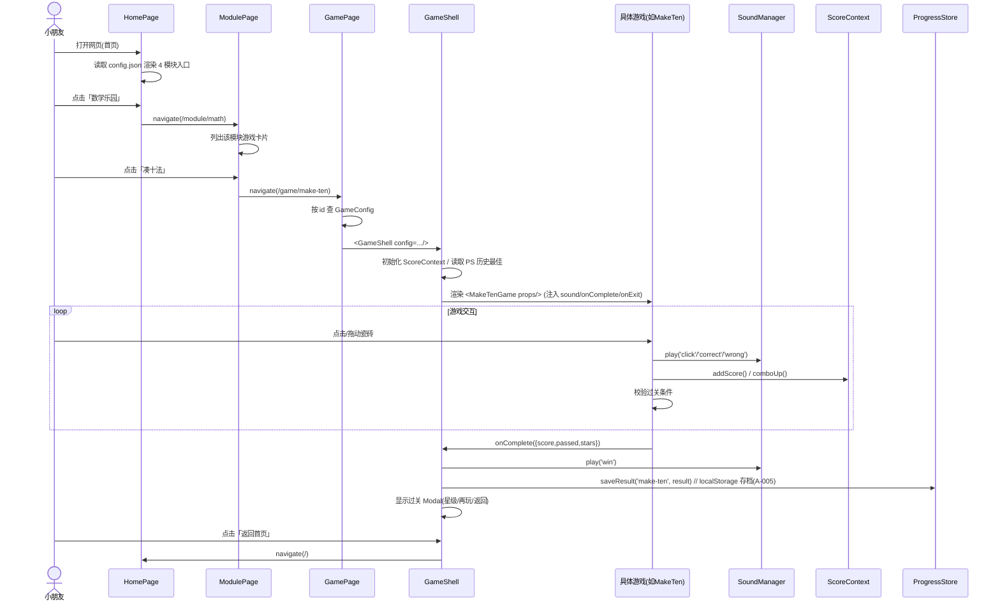

# 幼升小游戏合集网页版 · 系统架构设计与任务分解

> 架构师：**高见远（Gao）**  ｜  版本：v1.0  ｜  面向：工程师批量实现 + 主理人统筹
> 约束基线：纯前端 / GitHub Pages / 移动端触摸优先 / 可爱低龄 UI / 内容 JSON 可配置

---

## 1. 实现方案与框架选型

### 1.1 技术栈决策（含是否降级 MUI）

PRD 默认栈为 **Vite + React + MUI + Tailwind**，"可降级原生以减小体积"。经评估**建议降级 MUI**，最终采用：

| 维度 | 决策 | 理由 |
|------|------|------|
| 构建 | **Vite 5 + React 18 (TypeScript)** | 快、产物小、GitHub Pages 友好 |
| 样式 | **Tailwind CSS 3 + 自研卡通组件**（**弃用 MUI**） | MUI 的 Material 风格与圆体卡通低龄风冲突；MUI 体积大（~100KB+），不利"零门槛部署"；游戏需大量自定义交互 |
| 路由 | **react-router-dom 6 + HashRouter** | GitHub Pages 静态托管下 HashRouter 可避免刷新 404，`base:'./'` 保证资源相对路径正确 |
| 音效 | **Web Audio API 程序化生成短音效**（不引入任何外部音频素材） | 杜绝版权风险、零素材依赖、体积为零；用 OscillatorNode 合成"答对/答错/过关/点击"等音 |
| 状态 | **React Context + 自定义 `useLocalStorage` Hook**（**不引入 Redux/Zustand**） | 游戏状态本就局部化；跨局存档用 localStorage 即可，轻量够用 |
| 动画 | **CSS Transition + Tailwind**，按压回弹用 `active:scale` | 低龄 UI 的"按压回弹/大圆角"用纯 CSS 即可，无需动画库 |

> **核心架构决策一句话**：用 **Vite+React+Tailwind 自研卡通组件 + HashRouter + Web Audio 程序化音效 + localStorage 存档** 的零素材纯前端方案，既满足 GitHub Pages 免后端部署，又用内容 JSON 驱动四大模块全部游戏。

### 1.2 部署方案（GitHub Pages）

- `vite.config.ts` 设置 `base: './'`，产物内资源走相对路径。
- 路由统一用 **HashRouter**（`/#/math/make-ten`），刷新不会 404。
- 提供 `public/404.html`（内容同 `index.html`，双保险 SPA 回退）。
- 提供 `.github/workflows/deploy.yml`：push 到 `main` 后 `npm ci && npm run build`，用 `peaceiris/actions-gh-pages` 发布到 `gh-pages` 分支；仓库 Settings → Pages 选 `gh-pages` 分支根目录。

### 1.3 音效方案

`SoundManager` 用单个 `AudioContext`（首次用户交互后 `resume()`），按 `SoundType` 用不同频率/波形/包络合成：
- `click`：短促方波 660Hz 80ms
- `correct`：上行两音 660→880Hz 三角波
- `wrong`：下行 300→200Hz 锯齿波 200ms
- `win`：三音琶音 523→659→784Hz
- `levelup`：四音上行
所有音效均 `<300ms`，可一键全局静音（HUD 喇叭按钮）。

---

## 2. 文件列表及相对路径

```
docs/
  architecture-youxiao-games.md        # 本文件
index.html                             # Vite 入口 HTML
package.json                           # 依赖与脚本
vite.config.ts                         # Vite 配置(base:'./')
tailwind.config.js                     # Tailwind + 马卡龙主题 token
postcss.config.js                      # Tailwind/Autoprefixer
tsconfig.json                          # TS 配置
tsconfig.node.json                     # vite 配置用 TS
.github/workflows/deploy.yml           # GitHub Pages 自动部署
public/
  404.html                             # SPA 回退
src/
  main.tsx                             # React 挂载入口
  App.tsx                              # 根组件(ThemeProvider+Router)
  vite-env.d.ts
  router.tsx                           # HashRouter 路由表
  theme/
    tokens.ts                          # 颜色/圆角/字体 token(马卡龙)
    ThemeProvider.tsx                  # 全局主题/字体注入
  sound/
    SoundManager.ts                    # Web Audio 程序化音效核心类
    soundPresets.ts                    # 音效参数预设
  state/
    useLocalStorage.ts                 # localStorage 同步 Hook
    ScoreContext.tsx                   # 计分/连击/关卡 全局上下文
    ProgressStore.ts                   # 进度+成就+家长报告(P2: A-005)
  components/
    Button.tsx                         # 按压回弹按钮
    Card.tsx                           # 通用卡片(图片/文字/拼音)
    CardGrid.tsx                       # 配对类游戏共享网格
    HUD.tsx                            # 顶部分数/关卡/静音/返回
    GameShell.tsx                      # 游戏外壳(加载/结算/存档)
    Modal.tsx                          # 过关/失败弹窗
    ProgressBar.tsx                    # 进度条
    StarRating.tsx                     # 1~3 星评分
  games/
    types.ts                           # 共享游戏接口(GameProps/GameConfig/GameResult)
    math/
      index.ts                         # 数学模块游戏注册
      MakeTen/
        MakeTenGame.tsx                # G-002 凑十法(羊了个羊)
        makeTenLogic.ts                # 消子/层叠/过关逻辑
      PlusMinusLink/
        PlusMinusLinkGame.tsx          # G-003 加减连连看
        linkLogic.ts                   # 连线消除逻辑
      NumberMerge/
        NumberMergeGame.tsx            # M-001 数字合成(2048式)
        mergeLogic.ts
    pinyin/
      index.ts
      PinyinMatch/
        PinyinMatchGame.tsx            # G-004 声母韵母配对/拼读
        pinyinLogic.ts
      PinyinVariants/
        PinyinVariantsGame.tsx         # M-002 更多拼读变体
    hanzi/
      index.ts
      FlipMemory/
        FlipMemoryGame.tsx             # G-005 翻牌识字(+拼音)
        flipLogic.ts
      ConnectMatch/
        ConnectMatchGame.tsx           # 连线匹配(+拼音)
      MoreHanzi/
        MoreHanziGame.tsx              # M-003 更多识字玩法
    english/
      index.ts
      LetterCase/
        LetterCaseGame.tsx             # G-006 字母大小写配对
        letterLogic.ts
      WordImage/
        WordImageGame.tsx              # M-004 单词图文匹配
      SentenceFill/
        SentenceFillGame.tsx           # M-005 简单句填空
      BattleQuiz/
        BattleQuizGame.tsx             # M-006 答对攻击类
  pages/
    HomePage.tsx                       # G-001 主页(4 模块入口)
    ModulePage.tsx                     # 模块详情(该模块游戏列表)
    GamePage.tsx                       # 按路由加载具体游戏
  data/
    config.json                        # 游戏注册表/模块元信息
    math.json                          # 数学内容(凑十/连连看/合成)
    pinyin.json                        # 拼音内容(声母/韵母/音节)
    hanzi.json                         # 常用字内容(字/拼音/义/图)
    english.json                       # 英语内容(字母/单词/句子)
  utils/
    shuffle.ts                         # 洗牌(Fisher-Yates)
    rng.ts                             # 可种子随机
    gameLoop.ts                        # useGameLoop / useCountdown Hook
```

> 覆盖：**P0 全量**（主页、凑十法、加减连连看、拼音配对、翻牌识字、字母大小写、计分/音效/过关、响应式触摸）+ **P1 主要玩法**（数字合成、拼音变体、更多识字、单词图文、简单句填空、答对攻击）+ **P2 轻量存档**（A-005 localStorage 成就/进度）。

---

## 3. 数据结构和接口（类图 / 类型）

```mermaid
classDiagram
    %% ---------- 共享接口 ----------
    class GameConfig {
        +string id
        +ModuleKey module
        +string title
        +string icon
        +Priority priority
        +ComponentType~GameProps~ component
    }
    class GameProps {
        +GameConfig config
        +SoundManager sound
        +onComplete(result: GameResult): void
        +onExit(): void
    }
    class GameResult {
        +number score
        +boolean passed
        +number stars
        +number durationMs
    }
    class ModuleKey {
        <<enumeration>>
        math
        pinyin
        hanzi
        english
    }

    %% ---------- 音效 ----------
    class SoundManager {
        -AudioContext ctx
        -boolean enabled
        +play(type: SoundType): void
        +setEnabled(b: boolean): void
        +toggle(): boolean
    }
    class SoundType {
        <<enumeration>>
        click
        correct
        wrong
        win
        levelup
    }

    %% ---------- 状态 ----------
    class ScoreContext {
        -ScoreState state
        +addScore(n: number): void
        +comboUp(): void
        +levelUp(): void
        +reset(): void
    }
    class ScoreState {
        +number current
        +number best
        +number level
        +number combo
    }
    class ProgressStore {
        -Record~string,GameProgress~ progress
        +saveResult(id: string, r: GameResult): void
        +getProgress(id: string): GameProgress
        +getAchievements(): Achievement[]
        +exportReport(): ParentReport
    }
    class GameProgress {
        +number bestScore
        +number stars
        +number plays
        +boolean cleared
    }

    %% ---------- 共享 UI ----------
    class GameShell {
        +GameConfig config
        +render(): void
    }
    class HUD {
        +score: number
        +level: number
        +onExit(): void
        +onToggleSound(): void
    }
    class CardGrid {
        +CardItem[] items
        +onMatch(a: CardItem, b: CardItem): void
        +render(): void
    }
    class Card {
        +CardItem data
        +selected: boolean
        +matched: boolean
        +onClick(): void
    }
    class CardItem {
        +string id
        +string label
        +string pinyin
        +string emoji
        +string group
    }

    %% ---------- 各游戏逻辑(节选) ----------
    class MakeTenLogic {
        +Tile[][] layers
        +popTile(t: Tile): boolean
        +isCleared(): boolean
        +genLevel(cfg: object): Tile[][]
    }
    class LinkLogic {
        +Node[] nodes
        +canLink(a: Node, b: Node): boolean
        +removePair(a: Node, b: Node): void
    }
    class FlipLogic {
        +CardItem[] deck
        +flip(id: string): void
        +checkMatch(): boolean
    }
    class MergeLogic {
        +number[][] board
        +move(dir: Dir): boolean
        +spawn(): void
    }

    %% ---------- 关系 ----------
    GameProps "1" *-- "1" GameConfig
    GameProps "1" *-- "1" SoundManager
    GameProps ..> GameResult : onComplete
    GameShell "1" *-- "1" HUD
    GameShell "1" *-- "1" ScoreContext
    GameShell ..> ProgressStore : saveResult
    CardGrid "1" *-- "0..*" Card
    Card "1" *-- "1" CardItem
    MakeTenGame ..> MakeTenLogic
    PlusMinusLinkGame ..> LinkLogic
    FlipMemoryGame ..> FlipLogic
    NumberMergeGame ..> MergeLogic
    ScoreContext "1" *-- "1" ScoreState
    ProgressStore ..> GameProgress
```



### 关键 TypeScript 类型（`src/games/types.ts`）

```ts
export type ModuleKey = 'math' | 'pinyin' | 'hanzi' | 'english';
export type Priority = 'P0' | 'P1' | 'P2';
export type SoundType = 'click' | 'correct' | 'wrong' | 'win' | 'levelup';

export interface GameResult { score: number; passed: boolean; stars: number; durationMs: number; }
export interface GameConfig {
  id: string; module: ModuleKey; title: string; icon: string;
  priority: Priority; component: React.ComponentType<GameProps>;
}
export interface GameProps {
  config: GameConfig; sound: SoundManager;
  onComplete: (r: GameResult) => void; onExit: () => void;
}
```

### 内容 JSON Schema（节选）

```jsonc
// data/math.json
{ "makeTen": { "target": 10,
    "tiles": [{"value":1,"emoji":"🍎"},{"value":2,"emoji":"🍌"}],
    "levels": [{"rows":6,"cols":6,"layers":3}] },
  "plusMinusLink": { "range":[1,20], "levels":[{"count":12}] },
  "numberMerge": { "size":4, "target":2048 } }

// data/pinyin.json
{ "initials":["b","p","m","f"], "finals":["a","o","e"],
  "syllables":[{"initial":"b","final":"a","pinyin":"bà","emoji":"🐯","tone":4}] }

// data/hanzi.json
{ "cards":[{"char":"日","pinyin":"rì","emoji":"☀️","meaning":"太阳"},
           {"char":"月","pinyin":"yuè","emoji":"🌙","meaning":"月亮"}] }

// data/english.json
{ "letters":[{"upper":"A","lower":"a"},{"upper":"B","lower":"b"}],
  "words":[{"word":"cat","emoji":"🐱","meaning":"猫"}],
  "sentences":[{"template":"I see a ___","options":["cat","dog"],"answer":"cat"}] }

// data/config.json —— 游戏注册表(驱动主页/模块页)
{ "modules":[
    {"key":"math","title":"数学乐园","icon":"🔢","games":["make-ten","plus-minus-link","number-merge"]},
    {"key":"pinyin","title":"拼音王国","icon":"🔤","games":["pinyin-match","pinyin-variants"]},
    {"key":"hanzi","title":"识字城堡","icon":"📚","games":["flip-memory","connect-match","more-hanzi"]},
    {"key":"english","title":"英语小镇","icon":"🔡","games":["letter-case","word-image","sentence-fill","battle-quiz"]}
  ]}
```

---

## 4. 程序调用流程（时序图）



---

## 5. 任务列表（有序 · 含依赖 · 按实现顺序）

> 说明：遵循主理人"任务列表须足够细、工程师可逐条批量实现、按依赖顺序排列"的要求，按 **脚手架→共享层→各模块游戏→内容数据→P2 存档→联调部署** 展开。P0 优先、P1 紧随、P2 末尾。

| 编号 | 任务 | 产出文件（主要） | 依赖 | 优先级 | 说明 |
|------|------|------------------|------|--------|------|
| **T01** | 项目脚手架与部署配置 | `package.json`、`vite.config.ts`、`tailwind.config.js`、`postcss.config.js`、`tsconfig.json`、`tsconfig.node.json`、`index.html`、`public/404.html`、`.github/workflows/deploy.yml` | — | P0 | 建立 Vite+React+TS 工程；`base:'./'`；Tailwind 注入马卡龙色；GitHub Pages 自动部署工作流 |
| **T02** | 主题与基础共享层（音效/状态/存档） | `theme/tokens.ts`、`theme/ThemeProvider.tsx`、`sound/SoundManager.ts`、`sound/soundPresets.ts`、`state/useLocalStorage.ts`、`state/ScoreContext.tsx`、`state/ProgressStore.ts` | T01 | P0 | 马卡龙 token、卡通字体；Web Audio 程序化音效；计分/连击/关卡上下文；localStorage 进度骨架 |
| **T03** | 共享 UI 组件与游戏壳 | `components/Button.tsx`、`Card.tsx`、`CardGrid.tsx`、`HUD.tsx`、`GameShell.tsx`、`Modal.tsx`、`ProgressBar.tsx`、`StarRating.tsx` | T02 | P0 | 按压回弹按钮、卡片/网格、HUD（分/关/静音/返回）、GameShell（加载+结算+存档）、星级弹窗 |
| **T04** | 共享类型与工具 | `games/types.ts`、`utils/shuffle.ts`、`utils/rng.ts`、`utils/gameLoop.ts` | T01 | P0 | GameConfig/GameProps/GameResult 等接口；洗牌、可种子随机、useGameLoop/useCountdown |
| **T05** | 路由与主页/模块/游戏页 + 游戏注册表 | `router.tsx`、`App.tsx`、`main.tsx`、`pages/HomePage.tsx`、`pages/ModulePage.tsx`、`pages/GamePage.tsx`、`data/config.json` | T03,T04 | P0 | HashRouter 路由表；G-001 主页 4 模块入口；模块详情页；GamePage 按 id 加载游戏；config.json 驱动 |
| **T06** | 数学模块（P0 凑十法 + 加减连连看，P1 数字合成）+ 数据 | `games/math/*`（MakeTen、PlusMinusLink、NumberMerge 及各自 logic）、`data/math.json`、`games/math/index.ts` | T02,T04 | P0/P1 | 羊了个羊式消层、连线消除、2048 式合成；含计分/过关/音效接入 |
| **T07** | 拼音模块（P0 配对拼读，P1 变体）+ 数据 | `games/pinyin/*`（PinyinMatch、PinyinVariants）、`data/pinyin.json`、`games/pinyin/index.ts` | T02,T04 | P0/P1 | 声母×韵母配对与拼读；变体玩法；图文/拼音反馈 |
| **T08** | 常用字模块（P0 翻牌+连线，P1 更多）+ 数据 | `games/hanzi/*`（FlipMemory、ConnectMatch、MoreHanzi）、`data/hanzi.json`、`games/hanzi/index.ts` | T02,T04 | P0/P1 | 翻牌记忆+拼音、连线匹配；拓展识字玩法 |
| **T09** | 英语模块（P0 字母配对，P1 图文/填空/战斗）+ 数据 | `games/english/*`（LetterCase、WordImage、SentenceFill、BattleQuiz）、`data/english.json`、`games/english/index.ts` | T02,T04 | P0/P1 | 大小写配对、单词图文、简单句填空、答对攻击类 |
| **T10** | P2 轻量存档与成就（A-005） | `state/ProgressStore.ts`(扩展)、`pages/HomePage.tsx`(成就角)、`data/config.json`(成就定义) | T02,T05 | P2 | localStorage 持久化最佳分/星级/通关；成就解锁；轻量家长报告导出 |
| **T11** | 联调、触摸适配、响应式与构建部署验证 | 全量 `src/*`、`vite.config.ts`、`deploy.yml` | T06–T10 | P0 | pointer 事件统一鼠标/触摸；移动端布局；`npm run build` 校验；gh-pages 预览验证 |

> 依赖关系要点：T01 是所有任务的地基；T02/T03/T04 为共享能力，互不依赖（仅依赖 T01）；T05 依赖共享 UI 与类型；T06–T09 并行可交由工程师按模块各自推进；T10 依赖进度骨架与主页；T11 为收尾全量验证。

---

## 6. 依赖包列表（版本策略：最新稳定版）

```
# 运行时依赖
react@^18.3.1            # UI 框架
react-dom@^18.3.1        # DOM 渲染
react-router-dom@^6.26.0 # HashRouter 路由

# 开发依赖
vite@^5.4.0              # 构建工具
@vitejs/plugin-react@^4.3.1
typescript@^5.5.0        # 类型系统
tailwindcss@^3.4.0       # 原子化样式
postcss@^8.4.0           # Tailwind 处理
autoprefixer@^10.4.0
@types/react@^18.3.0
@types/react-dom@^18.3.0

# 部署
peaceiris/actions-gh-pages@v4   # GitHub Actions 用(非 npm 包，工作流引用)
```

> **降级说明**：**不引入 @mui/material、@emotion/react、@emotion/styled、zustand、redux**，以自研 Tailwind 组件 + Context 替代，显著减小产物体积、契合低龄卡通风格与"零门槛部署"。
> 脚本：`dev` / `build` / `preview`；CI 由 `deploy.yml` 执行 `npm ci && npm run build`。

---

## 7. 共享知识（跨文件约定）

- **命名规范**：组件 `PascalCase.tsx`；逻辑/工具 `camelCase.ts`；内容数据 `kebab.json`；共享游戏组件放 `src/components`，具体游戏放 `src/games/<module>/<Game>/`。
- **主题 token 用法**：颜色一律走 `theme/tokens.ts`（如 `color.peach=#FFB3C6`、`mint=#95E1C9`、`sky=#A0D2FF`、`lemon=#FFE066`、`cream=#FFF9F0`），Tailwind 在 `tailwind.config.js` 中扩展同名色板；圆角统一 `rounded-3xl`，字体用圆体卡通（`theme/ThemeProvider` 注入 web-font/系统圆体回退）。
- **音效调用约定**：游戏内**只允许**通过 `props.sound.play(type)` 触发；禁止直接 `new Audio()`。可选类型 `click|correct|wrong|win|levelup`；首次交互前 `SoundManager.resume()` 解锁 AudioContext；全局静音由 HUD 控制 `sound.toggle()`。
- **计分/关卡状态约定**：游戏运行期分数与连击走 `ScoreContext`（`addScore/comboUp/levelUp`）；游戏结束调用 `props.onComplete({score,passed,stars,durationMs})`，由 `GameShell` 统一 `ProgressStore.saveResult()` 落盘 localStorage；星级规则：passed 且用时/错误数低于阈值 → 3 星，依次递减。
- **移动端触摸事件约定**：**统一使用 Pointer Events**（`onPointerDown/Up/Move`）而非分别绑定 mouse/touch，保证鼠标与触摸一致；长按/拖拽用 `setPointerCapture`；禁用移动端默认缩放与文本选中（`touch-action: manipulation` + `user-select:none`）；可点击元素最小触控区 ≥ 44×44px。
- **内容驱动约定**：所有题目/字表/词表来自 `src/data/*.json`，游戏逻辑只读 JSON、不内嵌硬编码内容；新增题目只需改 JSON，无需改代码。
- **路由约定**：路径形如 `/#/<module>/<gameId>`，`GamePage` 用 `useParams` 取 `gameId` 再到 `config.json` 查 `GameConfig` 渲染对应 `component`。

---

## 8. 待明确事项（含默认决策）

| 待确认点 | 我的默认决策（若无异议即采纳） |
|----------|------------------------------|
| 是否保留 MUI？ | **不保留**，改用自研 Tailwind 卡通组件（体积/风格更优）。 |
| 圆体卡通字体的具体字体 | 优先系统圆体回退（`"PingFang SC","Microsoft YaHei",sans-serif` + `rounded` 视觉），如需更卡通可用免费字体（如 ZCOOL KuaiLe，需确认授权后引入），首版先用系统圆体。 |
| 拼音"拼读"是否需要真人/合成语音朗读 | 首版**不接入语音朗读**（仅视觉拼音+音效）；后续可加 `speechSynthesis` 浏览器 TTS（零素材），列为可选增强。 |
| 家长报告（P2）的呈现形式 | 首版仅做"本机 localStorage 导出一份 JSON/文本报告"的轻量实现，不做后台。 |
| 难度分级（P2）首版范围 | 首版在 JSON 内以 `levels` 数组提供 2~3 档，不做独立难度选择 UI；后续迭代再加。 |
| 成就系统（A-005）规模 | 首版 4~6 个简单成就（如"首次通关""集满 3 星""玩遍四模块"），定义在 config.json。 |
| 部署仓库分支命名 | 假定源分支 `main`、发布分支 `gh-pages`；若实际不同，调整 `deploy.yml` 即可。 |

---

### 一句话核心架构决策（汇报主理人齐活林）
采用 **Vite + React + Tailwind 自研卡通组件 + HashRouter + Web Audio 程序化音效 + localStorage 存档** 的零素材纯前端方案，以 `data/*.json` 内容驱动四大模块全部游戏，既满足 GitHub Pages 免后端零门槛部署，又完整覆盖 P0 全量与 P1 主要玩法、P2 轻量存档。
