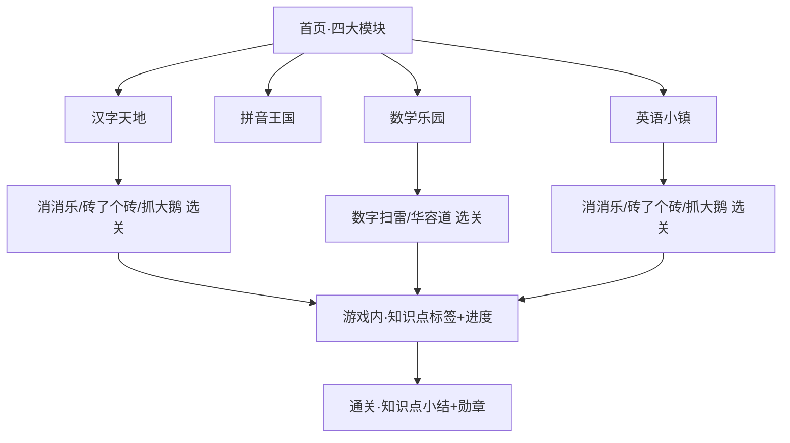
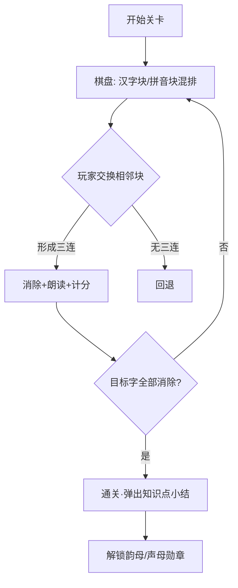
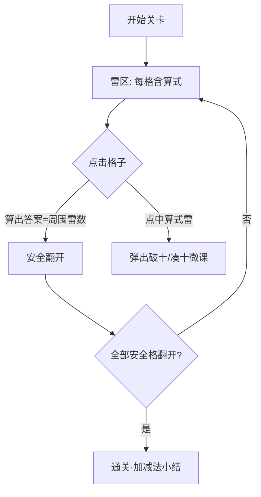
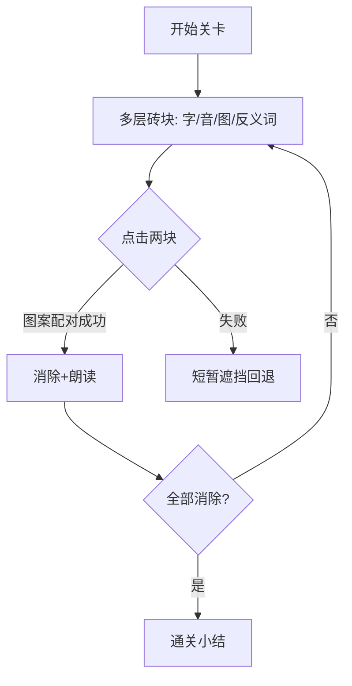
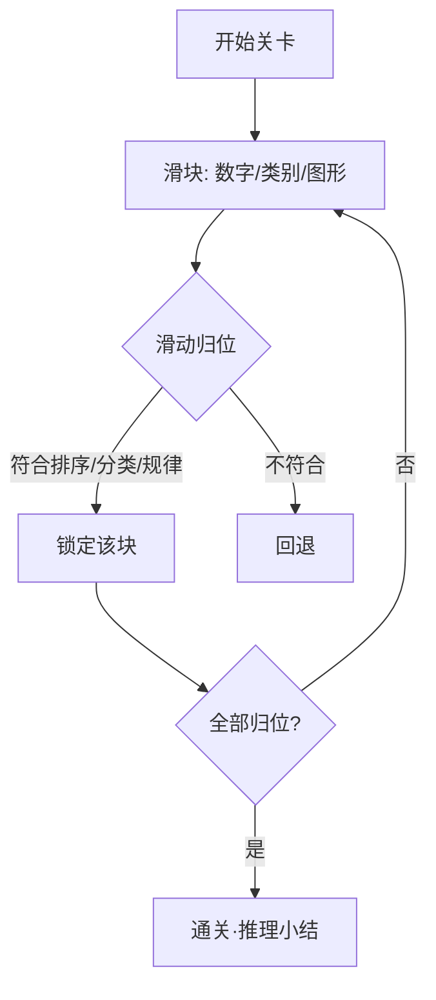
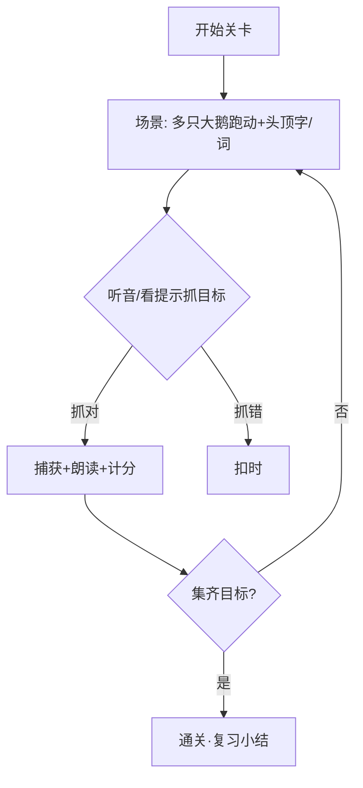
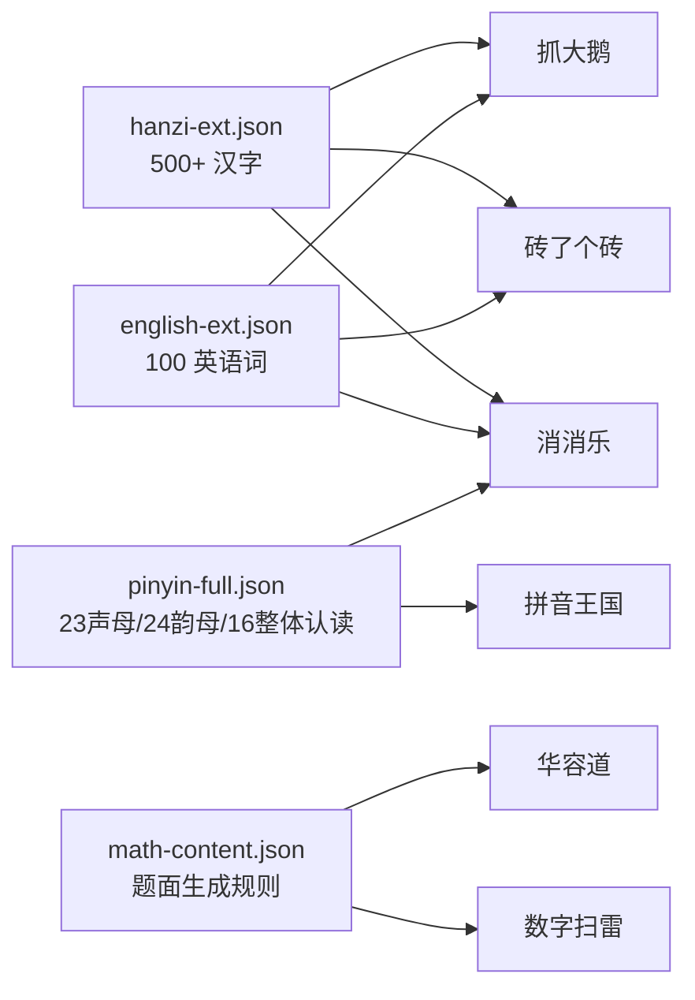
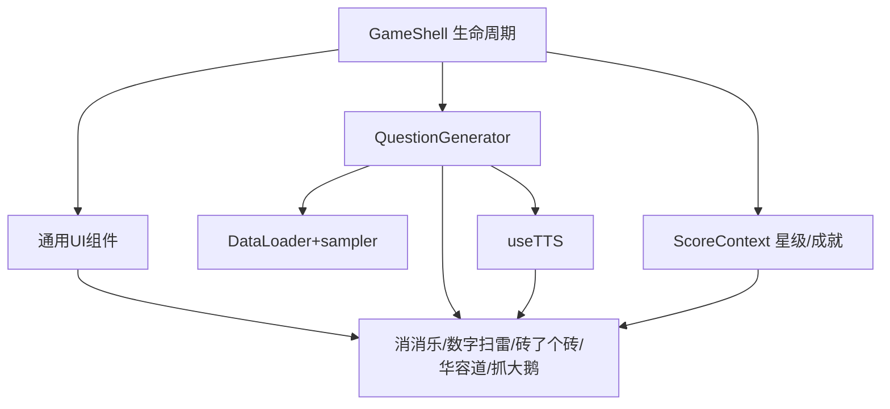

# 幼升小游戏合集 · 内容迭代 PRD（细化版 v2）

> 本文档在 v1 简单版 PRD 基础上细化，保留原有一～四章可用内容，新增「已确认范围」「题库扩充方案」「模块归属」「共享能力」「分批蓝图」等可直接进入架构设计阶段的章节。原 v1 中「待确认问题 / 建议 MVP 范围」已据用户拍板决策落实，见第九、十章。

## 项目信息

| 项 | 内容 |
|---|---|
| 文档语言 | 中文 |
| 技术栈 | Vite + React + TypeScript + Tailwind CSS（纯前端，与现状一致） |
| 模块归属 | **已确认**：按学科拆入现有四大模块（语文→汉字天地/拼音王国、数学→数学乐园、英语→英语小镇）；**不新增**独立「经典玩法」分类 |
| Project Name | youxiao_content_iteration |
| 文档类型 | 细化版 PRD（新增范围基线、题库 schema、共享能力、实施蓝图） |
| 原始需求 | 持续迭代幼升小教育游戏内容，将语文/数学/英语核心知识点深度融入经典游戏玩法（抓大鹅、消消乐、数字扫雷、砖了个砖、华容道），每关围绕核心知识设计，趣味性与教育性并重，适合幼升小。 |
| 首期范围（已拍板） | 5 个经典玩法**全做**；题库**全量扩充**（500+ 汉字 / 100 英语词 / 完整音节 / 数学生成规则）；家长教师端 MVP 暂不做 |

---

## 〇、已确认范围 / 已确认事项（范围基线）

以下 4 条为用户已拍板的决策，作为本 PRD 的**不可推翻基线**，后续所有设计均须遵守：

| # | 决策项 | 确认内容 |
|---|---|---|
| 1 | **首期范围** | 5 个经典玩法**全做**——抓大鹅、消消乐、数字扫雷、砖了个砖、华容道。 |
| 2 | **题库数据** | 本期**全量扩充**——① 500+ 常用高频汉字；② 100 个日常高频英语词；③ 完整声母韵母音节（23 声母 / 24 韵母 / 16 整体认读）；④ 数学知识点内容（20 以内进退位加减、连加连减混合、分类/排序/找规律/推理的**题面生成规则**）。 |
| 3 | **模块归属** | 新增玩法**按学科拆入现有四大模块**（语文→汉字天地/拼音王国、数学→数学乐园、英语→英语小镇），**不新增**独立「经典玩法」分类。 |
| 4 | **家长/教师端** | MVP **暂不做**（进度报告、教师后台、按知识点筛选关卡等留待后续迭代）。本 PRD 仅保留「每关知识点标签 + 通关小结」作为玩法内轻量反馈，不做独立后台。 |

---

## 一、产品目标（一句话）

将幼升小语文/数学/英语核心知识点深度嵌入 5 款经典游戏玩法，让儿童在「经典玩法」中自然掌握幼升小考点，实现趣味性与教育性并重的内容迭代。

---

## 二、用户故事

| 视角 | 用户故事 |
|---|---|
| 幼儿 · 语文 | 作为学龄前儿童，我希望在消消乐里把「汉字卡」和对应的「拼音卡」连消，以便边玩边记高频字与拼音。 |
| 幼儿 · 数学 | 作为学龄前儿童，我希望通过数字扫雷推算格子里的加减法答案，以便在游戏中理解凑十/破十算理。 |
| 幼儿 · 英语 | 作为学龄前儿童，我希望在配对玩法中把单词卡和图片连在一起，以便记住 100 个日常高频词。 |
| 抓大鹅（复习） | 作为学龄前儿童，我希望听音/看图去抓头顶对应字或词的大鹅，以便在做游戏时复习已学字词句。 |

> 注：v1 中「家长 / 教师」用户故事对应的进度报告、教师后台等功能，按决策 #4 本期不做，故从首期范围移除，保留上表 3 类幼儿视角故事。

---

## 三、需求池（5 玩法 × 知识点详细映射）

### 3.1 玩法—知识点映射总览

| 经典玩法 | 主融入学科 | 归属模块（key） | 核心知识点 | 优先级 |
|---|---|---|---|---|
| 消消乐 | 语文 / 英语 | hanzi + english | 高频汉字、声母韵母、整体认读、英语图文词 | P0 |
| 数字扫雷 | 数学 | math | 20以内进退位加减、连加连减、加减混合、找规律 | P0 |
| 砖了个砖 | 语文 / 英语 | hanzi + english | 汉字-拼音配对、单词-图配对、反义词/量词 | P1 |
| 华容道 | 数学 | math | 分类、排序、简单推理、找规律 | P1 |
| 抓大鹅 | 综合 / 复习 | hanzi + english | 汉字识别、英语词识别（趣味奖励型） | P2 |

### 3.2 逐玩法拆解（5 玩法 × 知识点详细映射）

对每个玩法给出：**服务学科**、**L1/L2/L3 如何围绕知识点设计**、**题目如何从知识点生成（含具体示例）**。

#### 玩法 1：消消乐（Match-3）—— P0
- **服务学科 / 模块**：语文（汉字天地，subject=`hanzi`）、英语（英语小镇，subject=`english`）。
- **核心机制**：交换相邻卡块，使同类三连（横/竖）消除。
- **L1 汉字-拼音配对**：卡面为「汉字块」与「拼音块」；同一字的汉字块与拼音块相邻三连即消除，建立字-音联结。
  - **题目生成**：从 `hanzi-ext.json` 抽取 N 个目标字 → 每字生成「字块(妈) + 拼音块(mā)」两枚 → 棋盘混入干扰字块；通关目标：消除全部目标字。
- **L2 词-图三连**：卡面拆为「汉字块 + 拼音块 + 词图块」三类，需同词三枚相邻三连（强化拼读 + 语义）。
  - **题目生成**：从 `hanzi-ext` 与 `english-ext` 抽目标词（含字/音/emoji），三枚一组；英语关用 `word + emoji + meaning`。
- **L3 反义词进阶**：消除规则新增「反义词对」可消除组（大-小、多-少），棋盘含反义字块。
  - **题目生成**：从 `hanzi-ext` 的 `antonym` 字段抽对，作为特殊可消除组；连续消除 5 个同韵母字解锁「韵母勋章」。
- **映射示例**：目标字「妈(mā)」→ 🀄妈 / `mā` 同字三连消除并 TTS 朗读；英语关「apple / 🍎 / 苹果」三连。

#### 玩法 2：数字扫雷（Minesweeper Numbers）—— P0
- **服务学科 / 模块**：数学（数学乐园）。
- **核心机制**：每格显示一道算式，该格「周围 8 格中地雷数 = 算式答案」；算出答案即知周围雷数，安全翻开。
- **L1 10 以内加法**：格算式如 `3+?=7`，周围恰 4 雷。
  - **题目生成**：`math-content.addSubtract.within10` 生成算式，布置雷使周围雷数=答案。
- **L2 20 以内进位加（凑十微课）**：格算式 `7+□=13`，附凑十提示卡（7+3=10，10+3=13），周围 6 雷。
  - **题目生成**：`addSubtract.carry20` 生成，携带 `make-ten` 提示；点错弹出「凑十法」微课。
- **L3 退位减 + 连加连减混合（找规律）**：格算式 `15-□=8`（破十法）/ `2+3+?=10`；雷区按 ABAB 规律排列训练找规律。
  - **题目生成**：`addSubtract.borrow20` / `mixedChain` 生成；雷区坐标按 `logic.pattern` 规则排布。
- **映射示例**：格子显示 `8+?=15` → 答案 7 → 该格周围 8 格恰有 7 雷（凑十：7+3=10，10+3=13）。

#### 玩法 3：砖了个砖（Brick Match）—— P1
- **服务学科 / 模块**：语文（汉字天地）、英语（英语小镇）。
- **核心机制**：多层砖块叠放，点击露出相同图案的两块即消除。
- **L1 汉字-拼音配对**：砖为「字-音」对。
  - **题目生成**：`hanzi-ext` 抽字对（大/小 等可带反义）。
- **L2 词-图 + 量词搭配**：砖为「词块-图块」或「量词+名词」配对（一[朵]花）。
  - **题目生成**：`hanzi-ext` 的 `measureWord` 字段 + `english-ext` 的 `emoji` 生成配对。
- **L3 反义词/综合**：反义词对砖（大-小）、跨模块混合。
  - **题目生成**：`hanzi-ext.antonym` 抽对。
- **映射示例**：上层「大」与下层「小」配对消除；「朵」+「花🌸」配对；`apple` + 🍎 配对。

#### 玩法 4：华容道（Klotski）—— P1
- **服务学科 / 模块**：数学（数学乐园）。
- **核心机制**：滑块需按目标规则（排序/分类/规律/推理）归位才能通关。
- **L1 排序**：数字/字母滑块按升序归位。
  - **题目生成**：`logic.sort` 生成乱序序列，目标 `asc`。
- **L2 分类**：滑块按类别归位（会飞/不会飞）。
  - **题目生成**：`logic.classify` 维度生成属性集合。
- **L3 找规律/推理**：按图形规律补齐缺失，或简单推理。
  - **题目生成**：`logic.pattern` 规则生成序列含缺口（▲●■▲●■ 补 ■）。
- **映射示例**：方块 3/1/4/2 → 滑成 1-2-3-4；动物方块按会飞/不会飞归位；▲●■▲●■ 补 ■。

#### 玩法 5：抓大鹅（Goose Catch）—— P2
- **服务学科 / 模块**：综合/复习（汉字天地、英语小镇）。
- **核心机制**：场景多只大鹅跑动，头顶字/词；听音或看提示抓「目标字」鹅，抓错扣时。
- **L1 汉字识别**：TTS 播拼音，抓对应字鹅。
  - **题目生成**：`hanzi-ext` 抽字，`useTTS` 播 `pinyin`。
- **L2 英语词识别**：显 emoji，抓对应词鹅。
  - **题目生成**：`english-ext` 抽 `word + emoji`。
- **L3 混合复习**：字+词混合，限时挑战。
  - **题目生成**：跨 `hanzi-ext` / `english-ext` 随机抽题。
- **映射示例**：播「mā」→ 抓「妈」鹅；显 🍎 → 抓「apple」鹅。

### 3.3 优先级汇总（首期全做，按工程批次排序）
- **P0（首期必做·先落地）**：消消乐、数字扫雷。
- **P1（首期必做·次批）**：砖了个砖、华容道。
- **P2（首期必做·末批）**：抓大鹅。
- 说明：5 个玩法均在首期范围（见「〇、已确认范围」决策 #1），此处优先级仅用于**工程落地顺序**，不代表范围裁剪。

---

## 四、UI 设计稿

### 4.1 整体玩法选择结构


### 4.2 消消乐核心界面与交互


### 4.3 数字扫雷核心界面与交互


### 4.4 砖了个砖核心界面与交互


### 4.5 华容道核心界面与交互


### 4.6 抓大鹅核心界面与交互


---

## 五、全量题库扩充方案（数据结构）

### 5.1 数据文件清单与调用关系
新增 4 个数据文件（保留现有 `hanzi.json`/`english.json`/`pinyin.json`/`math.json` 作为原型子集，新文件为全量扩充，二者可并存由加载层合并）：



| 文件 | 用途 | 建议路径 |
|---|---|---|
| 汉字全量 | 500+ 高频汉字及属性 | `src/data/hanzi-ext.json` |
| 英语词全量 | 100 日常高频英语词 | `src/data/english-ext.json` |
| 拼音全量 | 完整音节体系 + 例字 | `src/data/pinyin-full.json` |
| 数学内容 | 算式/逻辑题面生成规则 | `src/data/math-content.json` |

### 5.2 汉字全量 schema（`hanzi-ext.json`）
```json
{
  "version": 1,
  "chars": [
    {
      "char": "大",
      "pinyin": "dà",
      "initial": "d",          // 声母，关联 pinyin-full.initials
      "final": "a",            // 韵母，关联 pinyin-full.finals
      "tone": 4,               // 声调 1-4
      "radical": "大",         // 部首
      "strokes": 3,            // 笔画数
      "emoji": "🐘",
      "meaning": "大小",
      "antonym": "小",         // 反义词（消消乐L3/砖了个砖L3用）
      "measureWord": "个",     // 可搭配量词（砖了个砖L2用）
      "level": 1,              // 难度等级 1/2/3 对应 L1/L2/L3
      "tags": ["反义词", "常用字"]
    }
    // ... 共 500+ 条
  ]
}
```
**被调用方式**：消消乐(L1 取 `char`+`pinyin`；L3 取 `antonym` 反义词组)｜砖了个砖(L1 字-音配 `char`+`pinyin`；L2 量词配 `measureWord`)｜抓大鹅(L1 `useTTS` 播 `pinyin` 抓 `char`)。

### 5.3 英语词全量 schema（`english-ext.json`）
```json
{
  "version": 1,
  "words": [
    {
      "word": "apple",
      "emoji": "🍎",
      "meaning": "苹果",
      "category": "food",             // 类别（砖了个砖分类玩法可复用）
      "sentence": "I eat an apple.",  // 所属交际句型
      "level": 1
    }
    // ... 共 100 条
  ]
}
```
**被调用方式**：消消乐(L2 词-图三连取 `word`+`emoji`+`meaning`)｜砖了个砖(L2 词-图配 `word`+`emoji`)｜抓大鹅(L2 显 `emoji` 抓 `word`)。

### 5.4 拼音全量 schema（`pinyin-full.json`）
```json
{
  "version": 1,
  "initials": ["b","p","m","f","d","t","n","l","g","k","h","j","q","x","zh","ch","sh","r","z","c","s","y","w"], // 23 声母
  "finals": ["a","o","e","i","u","ü","ai","ei","ui","ao","ou","iu","ie","üe","er","an","en","in","un","ün","ang","eng","ing","ong"], // 24 韵母
  "wholeSyllables": ["zhi","chi","shi","ri","zi","ci","si","yi","wu","yu","ye","yue","yuan","yin","yun","ying"], // 16 整体认读
  "syllables": [
    { "initial": "b", "final": "a", "pinyin": "bā", "tone": 1, "char": "八", "emoji": "8️⃣", "meaning": "数字8", "level": 1 }
    // ... 完整音节例字表（按 initial×final 组合 + 整体认读）
  ]
}
```
**被调用方式**：消消乐(L2 拼音块取 `pinyin`；「韵母勋章」按 `final` 分类统计)｜拼音王国(拼读/听音选拼音玩法取 `syllables`)｜数字扫雷(音节作为拼读素材)。

### 5.5 数学内容 schema（`math-content.json`）
> 数学以**题面生成规则**而非静态题面存储，玩法在运行时按规则随机生成，保证题量无限且不占仓储。
```json
{
  "version": 1,
  "addSubtract": {
    "within10":   { "ops": ["+"], "max": 10, "strategies": [] },
    "carry20":    { "ops": ["+"], "max": 20, "strategies": ["make-ten"],  "hint": "凑十法" },
    "borrow20":   { "ops": ["-"], "max": 20, "strategies": ["break-ten"], "hint": "破十法" },
    "mixedChain": { "ops": ["+","-"], "terms": 3, "max": 20, "strategies": ["chain"], "hint": "连加连减" }
  },
  "logic": {
    "sort":    { "types": ["number","letter","size"], "orders": ["asc","desc"] },
    "classify":{ "dimensions": [{"key":"fly","values":["会飞","不会飞"]}], "examples": [] },
    "pattern": { "shapes": ["▲","●","■"], "rules": ["AB","AAB","ABAB"] },
    "reason":  { "gridSize": 2 }
  }
}
```
**被调用方式**：数字扫雷(从 `addSubtract` 按关卡选规则生成算式，雷数=答案)｜华容道(从 `logic` 的 sort/classify/pattern/reason 生成题面)。

---

## 六、按学科拆入现有模块的具体归属（config.json 扩展草案）

### 6.1 归属清单

| 玩法 | 学科 | 归属模块（key） | 同一 id 在 config 出现次数 | subject 取值 |
|---|---|---|---|---|
| 消消乐 | 语文 + 英语 | `hanzi` + `english` | 2（两模块各一条） | `hanzi` / `english` |
| 数字扫雷 | 数学 | `math` | 1 | `math` |
| 砖了个砖 | 语文 + 英语 | `hanzi` + `english` | 2 | `hanzi` / `english` |
| 华容道 | 数学 | `math` | 1 | `math` |
| 抓大鹅 | 综合/复习 | `hanzi` + `english` | 2 | `hanzi` / `english` |

### 6.2 config.json 扩展草案
新增游戏条目沿用现有 `{id,title,icon,priority}` 结构，并扩展 `subject` / `mode` 两个可选字段，供游戏组件选择题库池：

```json
{
  "modules": [
    {
      "key": "math",
      "title": "数学乐园", "icon": "🔢",
      "description": "凑十法 · 加减连连看 · 数字合成 · 经典玩法",
      "games": [
        { "id": "make-ten", "title": "凑十法", "icon": "🍎", "priority": "P0" },
        { "id": "plus-minus-link", "title": "加减连连看", "icon": "➕", "priority": "P0" },
        { "id": "number-merge", "title": "数字合成", "icon": "🔢", "priority": "P1" },
        { "id": "sudoku", "title": "数独", "icon": "🔢", "priority": "P1" },
        { "id": "sudoku-letter", "title": "字母数独", "icon": "🔠", "priority": "P1" },
        { "id": "sudoku-math", "title": "算术数独", "icon": "➕", "priority": "P1" },
        { "id": "number-mines", "title": "数字扫雷", "icon": "💣", "priority": "P0", "subject": "math" },
        { "id": "klotski", "title": "华容道", "icon": "🧩", "priority": "P1", "subject": "math" }
      ]
    },
    {
      "key": "pinyin",
      "title": "拼音王国", "icon": "🔤",
      "description": "声母韵母 · 拼读练习 · 听音选拼音",
      "games": [
        { "id": "pinyin-match", "title": "声母韵母拼读", "icon": "🔡", "priority": "P0" },
        { "id": "pinyin-variants", "title": "拼读变体", "icon": "🎯", "priority": "P1" },
        { "id": "pinyin-listen", "title": "听音选拼音", "icon": "🎧", "priority": "P1" }
      ]
    },
    {
      "key": "hanzi",
      "title": "汉字天地", "icon": "📚",
      "description": "翻牌记忆 · 连线匹配 · 识字玩法 · 经典玩法",
      "games": [
        { "id": "flip-memory", "title": "翻牌记忆", "icon": "🃏", "priority": "P0" },
        { "id": "connect-match", "title": "连线匹配", "icon": "🔗", "priority": "P0" },
        { "id": "more-hanzi", "title": "趣味识字", "icon": "✏️", "priority": "P1" },
        { "id": "match-3", "title": "消消乐", "icon": "🍬", "priority": "P0", "subject": "hanzi", "mode": "hanzi-pinyin" },
        { "id": "brick-match", "title": "砖了个砖", "icon": "🧱", "priority": "P1", "subject": "hanzi", "mode": "char-pinyin" },
        { "id": "goose-catch", "title": "抓大鹅", "icon": "🪿", "priority": "P2", "subject": "hanzi", "mode": "char-listen" }
      ]
    },
    {
      "key": "english",
      "title": "英语小镇", "icon": "🔤",
      "description": "字母 · 单词 · 句子 · 对战 · 经典玩法",
      "games": [
        { "id": "letter-case", "title": "大小写配对", "icon": "🔠", "priority": "P0" },
        { "id": "word-image", "title": "单词图文", "icon": "🖼️", "priority": "P1" },
        { "id": "sentence-fill", "title": "句子填空", "icon": "📝", "priority": "P1" },
        { "id": "battle-quiz", "title": "答题大作战", "icon": "⚔️", "priority": "P1" },
        { "id": "match-3", "title": "消消乐", "icon": "🍬", "priority": "P0", "subject": "english", "mode": "word-image" },
        { "id": "brick-match", "title": "砖了个砖", "icon": "🧱", "priority": "P1", "subject": "english", "mode": "word-image" },
        { "id": "goose-catch", "title": "抓大鹅", "icon": "🪿", "priority": "P2", "subject": "english", "mode": "word-look" }
      ]
    }
  ]
}
```
> 说明：同一 `id`（如 `match-3`）出现在 `hanzi` 与 `english` 两模块，靠 `subject` 区分题库池；游戏组件读取当前模块条目的 `subject` 决定加载 `hanzi-ext` 还是 `english-ext`。`achievements` 数组沿用现有结构，无需改动。

---

## 七、共享能力识别（供架构师设计「共享内核」）

以下能力跨 5 个玩法复用，建议抽为共享内核，避免重复实现：

| 能力域 | 建议模块 / 组件 | 被哪些玩法复用 | 说明 |
|---|---|---|---|
| 游戏框架 / 生命周期 | `GameShell` + `useGameLoop` | 全部 5 个 | 统一「选关 → 进行 → 星级结算」状态机与倒计时/暂停 |
| 通用 UI 组件 | `Card` / `DragDrop` / `GridBoard` / `MatchDetector` / `Brick` / `Slider` | 消消乐/砖了个砖/华容道/抓大鹅 | 卡片、拖拽、网格、三连判定、砖块、滑块 |
| 知识点→题目生成器 | `QuestionGenerator`（分 `hanzi`/`pinyin`/`english`/`math` 子生成器） | 全部 | 按学科 + 关卡 L1/L2/L3 从题库生成题面（见第五章 schema） |
| 题库加载与随机抽题 | `DataLoader` + `sampler`（loadJSON / pickRandom / pickByLevel） | 全部 | 合并 `hanzi.json`+`hanzi-ext.json` 等，按 `level`/标签抽题 |
| TTS 朗读封装 | `useTTS`（speechSynthesis 包装，支持中/英发音） | 消消乐/砖了个砖/抓大鹅 | 汉字播 `pinyin`、英语播 `word` |
| 星级 / 进度 / 成就 | 现有 `ScoreContext` | 全部 | 三星结算、勋章（韵母/声母）、进度持久化（localStorage） |



---

## 八、分批实现建议（实施蓝图）

尽管 5 个玩法首期全做，工程落地按「先内核后玩法、先 P0 后 P2」分 4 批，理由与范围如下：


| 批次 | 范围 | 关键交付 | 理由 |
|---|---|---|---|
| **第 1 批（地基）** | 共享内核 + 全量题库 | `GameShell`/`useGameLoop`、通用 UI 组件、`QuestionGenerator`(4 学科)、`DataLoader`+`sampler`、`useTTS`、扩展 `ScoreContext`；新建 `hanzi-ext.json`/`english-ext.json`/`pinyin-full.json`/`math-content.json` | 5 个玩法全部依赖内核与题库，先固化接口契约，降低后续返工 |
| **第 2 批（P0）** | 消消乐 + 数字扫雷 | 消消乐（`hanzi`+`english` 双 subject）、数字扫雷（算式生成+凑十/破十微课） | 知识点映射最自然、技术成熟，单批即覆盖语/数/英三科核心难点，可尽早验证内核 |
| **第 3 批（P1）** | 砖了个砖 + 华容道 | 砖了个砖（字-音/词-图/反义词/量词）、华容道（排序/分类/规律/推理） | 配对/逻辑玩法，直接复用第 1 批 `Brick`/`Slider`/`MatchDetector` 与 `logic` 生成规则 |
| **第 4 批（P2）** | 抓大鹅 | 抓大鹅（听音/看图抓字词，限时复习） | 趣味奖励型，依赖 `useTTS` 与 `sampler` 抽题，放在最后以最小风险收尾 |

> 第 3、4 批可视资源并行；但**第 1 批必须最先完成**且不被后续批次阻塞。

---

## 九、待确认问题（历史决议记录）

v1 中列出的开放问题，已据「〇、已确认范围」全部落实，记录如下：

| 原问题 | 决议结果 |
|---|---|
| 1. 首期做几个玩法 | 决策 #1：**5 个全做**。 |
| 2. 题库是否全量扩充 | 决策 #2：**全量扩充**（500+ 汉字 / 100 英语词 / 完整音节 / 数学生成规则）。 |
| 3. P0/P1/P2 排序 | 维持：消消乐/数字扫雷 P0，砖了个砖/华容道 P1，抓大鹅 P2（仅用于批次顺序，见第八章）。 |
| 4. 模块归属 | 决策 #3：**按学科拆入四大模块，不新增独立分类**。 |
| 5. 家长/教师端 | 决策 #4：**MVP 暂不做**。 |
| 6. 难度与适龄 | L1/L2/L3 对应 `level` 1/2/3，`hanzi-ext`/`english-ext` 已带 `level` 字段，由 `sampler` 按级抽题。 |
| 7. 音视频与无障碍 | 本期以 `useTTS` 朗读为核心；大字号/护眼模式留待后续迭代（不阻塞首期）。 |

---

## 十、建议首期（MVP）范围（最终版）

综合「〇、已确认范围」与第八章蓝图，首期范围为 **5 个玩法全做**，分 4 批落地：

1. **第 1 批（地基）**：共享内核 + 全量题库系统（必先行）。
2. **第 2 批（P0）**：消消乐（语文+英语）、数字扫雷（数学）。
3. **第 3 批（P1）**：砖了个砖（语文+英语）、华容道（数学）。
4. **第 4 批（P2）**：抓大鹅（综合复习）。

**内容数据策略（修正 v1）**：与 v1「先用现有子集」建议不同，已拍板**本期一次性全量扩充**题库（见第五章 schema）；现有 `hanzi.json` 等原型子集由 `DataLoader` 合并入全量文件，不重复维护。
